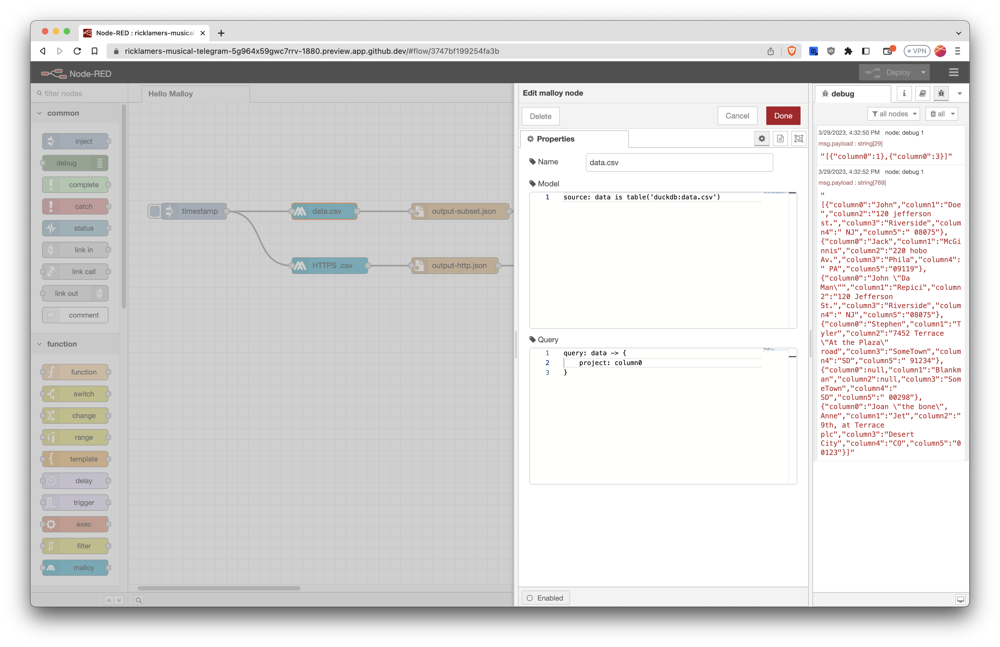

# Malloy based flows in Node-RED 

Malloy is a new experimental language for data. It compiles to SQL. Read more [here](https://www.malloydata.dev/).

Node-RED is a UI for building event flows that run on Node.js. Read more [here](https://github.com/node-red/node-red).

